# SANGAM

> Local-first event photo synchronization network.

SANGAM is an Android application that synchronizes event photos in real time across participant devices over a local event network without requiring Internet connectivity. Attendees continue using their phone's native OEM camera. Photos taken during an active event session are automatically detected from the Android MediaStore, validated through a capture boundary filter, assigned a deterministic client-side identity, and queued in a disk-backed local outbox. When connected to the Event Host over Wi-Fi or a local mobile hotspot, compressed thumbnails are pushed to the Host's embedded HTTP server and broadcast to all participants via WebSockets for instant live gallery display. Full-resolution originals remain on the capturing device and are retrieved on demand. An optional, decoupled online backup queue allows users to selectively push photos to external cloud storage when Internet access becomes available, without coupling or interrupting local room operations.

<p align="center">
  
  
  
  
  
  
  
  
</p>

---

## Product Experience

SANGAM enables attendees to capture photos naturally using their standard device camera while maintaining a synchronized, collective event gallery on the local network.

<table align="center">
  <tr>
    <td align="center" width="33%">
      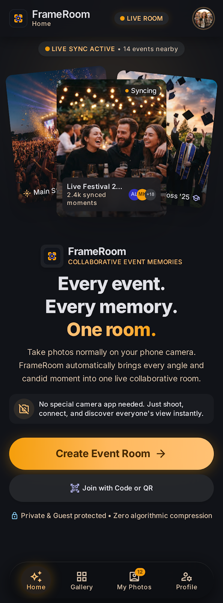<br />
      <strong>1. Welcome & Onboarding</strong><br />
      <sub>Role selection for hosting an event room or joining an existing room via QR.</sub>
    </td>
    <td align="center" width="33%">
      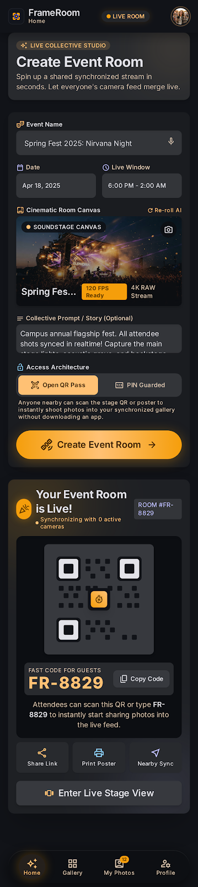<br />
      <strong>2. Create Event Room</strong><br />
      <sub>Host configures room name, parameters, and initiates local edge server.</sub>
    </td>
    <td align="center" width="33%">
      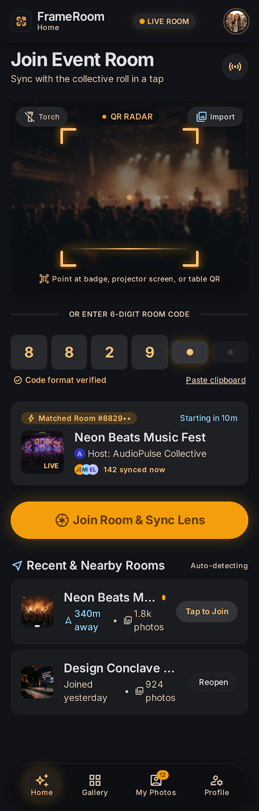<br />
      <strong>3. Join via QR Handshake</strong><br />
      <sub>Guest scans Host QR containing local IP, port, roomId, and security token.</sub>
    </td>
  </tr>
  <tr>
    <td align="center" width="33%">
      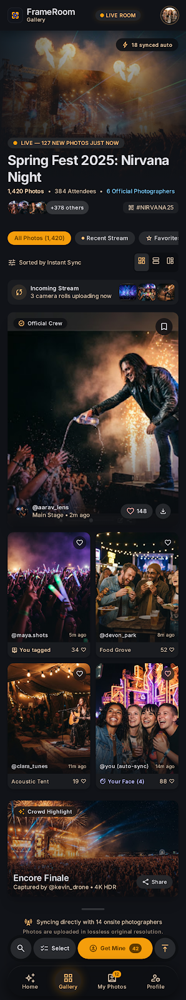<br />
      <strong>4. Live Event Gallery</strong><br />
      <sub>Real-time masonry grid updating dynamically via WebSocket event broadcasts.</sub>
    </td>
    <td align="center" width="33%">
      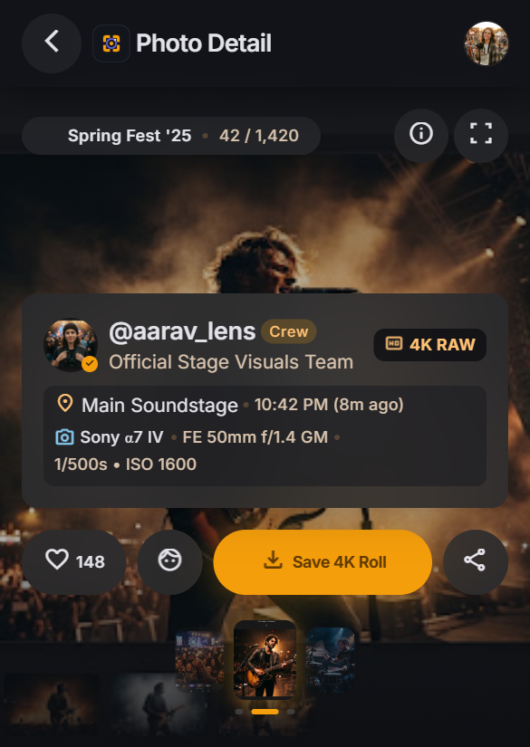<br />
      <strong>5. Photo Detail & Full-Resolution</strong><br />
      <sub>Detailed inspection view with on-demand retrieval of high-resolution original image.</sub>
    </td>
    <td align="center" width="33%">
      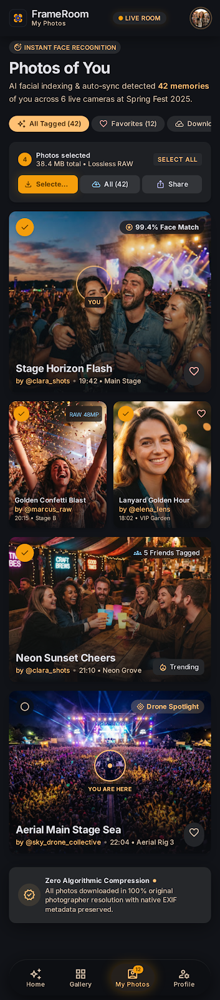<br />
      <strong>6. My Photos & Outbox Tracking</strong><br />
      <sub>Inspection of local capture status, delivery states, and selective online backup.</sub>
    </td>
  </tr>
  <tr>
    <td align="center" width="33%">
      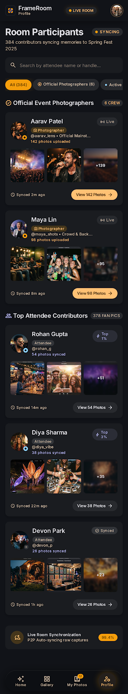<br />
      <strong>7. Room Participants</strong><br />
      <sub>Active client list, connection statuses, and per-participant contribution counts.</sub>
    </td>
    <td align="center" width="33%">
      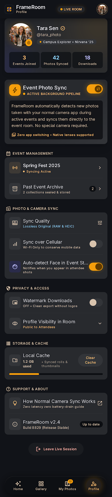<br />
      <strong>8. Profile & Storage Settings</strong><br />
      <sub>Participant handle configuration, local cache management, and storage controls.</sub>
    </td>
    <td align="center" width="33%">
      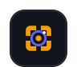<br />
      <strong>Local-First System</strong><br />
      <sub>Engineered for zero-cloud venue independence and resilient local photo delivery.</sub>
    </td>
  </tr>
</table>

---

## Problem

In-person events (weddings, conferences, meetups, campus gatherings) generate hundreds or thousands of photos across disparate participant devices. Existing workflows suffer from two primary failure modes:

1. **Manual In-The-Moment Sharing ($N \times N$ Fragmentation):** Group messaging apps require manual file picking and selective sending. Attendees repeatedly request photos from one another, high-resolution media is aggressively compressed, and many captured moments are never shared.
2. **Post-Event Centralized Dumping:** Event organizers frequently share cloud storage links (Google Drive, Dropbox) days or weeks after the event. Uploads require stable Internet, browse like generic document directories rather than event feeds, and have low participation rates.
3. **Venue Connectivity Deficits:** Large gatherings regularly experience cellular congestion or lack reliable broadband Internet, rendering cloud-dependent photo sharing services inoperable.

---

## Solution

SANGAM introduces a local-first event photo network engineered to operate directly over the venue's local Wi-Fi or a mobile hotspot:

- **Native Camera Workflow:** Attendees capture photos using their normal OEM camera application. No in-app viewfinder is enforced.
- **Automated Capture Boundary:** Background Android MediaStore observation identifies only photos captured after the active event session begins. Pre-existing camera roll images are completely isolated and never exposed.
- **Host-Centric Local Delivery:** The event organizer's phone acts as the local edge authority via an embedded Ktor HTTP server and WebSocket broadcaster.
- **Zero Internet Requirement:** Local synchronization functions entirely offline. Mobile data can be disabled.
- **Persistent Local Outbox:** Photos are buffered in disk-backed durable storage. If the Host network is out of range, photos accumulate locally and synchronize automatically upon reconnection.
- **Decoupled Online Upload:** Cloud backup is treated as an optional secondary subsystem that requires explicit user selection and never blocks or impacts local event operations.

---

## How It Works

1. **Host Establishes Room:** The organizer creates an event room. The application spins up an embedded Ktor server on a local TCP port and displays a connection QR code containing the local IP address, port, room ID, and session credentials.
2. **Guests Join via Local Network:** Guest devices connect to the same Wi-Fi router or Host mobile hotspot, scan the QR code, and establish a WebSocket subscription to the Host.
3. **Capture Baseline Established:** When a guest joins, the background observer takes an instantaneous baseline snapshot of all pre-existing media IDs in the device's MediaStore.
4. **Photos Captured Normally:** The user takes pictures with their standard camera app. MediaStore content notifications trigger SANGAM's evaluation pipeline.
5. **Eligibility Evaluation:** Candidates are verified against session timestamps, baseline exclusions, MIME types, camera folder paths, and complete file writes.
6. **Deterministic Identity Generation:** Eligible photos are assigned a deterministic SHA-256 fingerprint derived from device ID, room ID, capture timestamp, and payload bytes.
7. **Local Outbox Buffering:** The photo record and generated thumbnail are saved to durable local storage in state `QUEUED`.
8. **HTTP Multipart Sync:** The outbox worker pushes the thumbnail to the Host via `POST /sync/photo`.
9. **Host Deduplication & SyncAck:** The Host verifies uniqueness against its processed photo set, persists the thumbnail, broadcasts the addition to all connected clients over WebSockets, and returns an HTTP 200 `SyncAck`.
10. **State Updated to ACKED:** Upon receiving the `SyncAck`, the guest updates the outbox record to `ACKED`. The photo is now fully confirmed on the local network.
11. **On-Demand Full-Resolution:** Participants viewing the live gallery see compressed thumbnails immediately. Tapping an image initiates an on-demand HTTP request to fetch the full-resolution original directly from the host cache or source device.

---

## Architecture

The diagram below illustrates the end-to-end data flow for both local event room synchronization and the independent online upload subsystem:

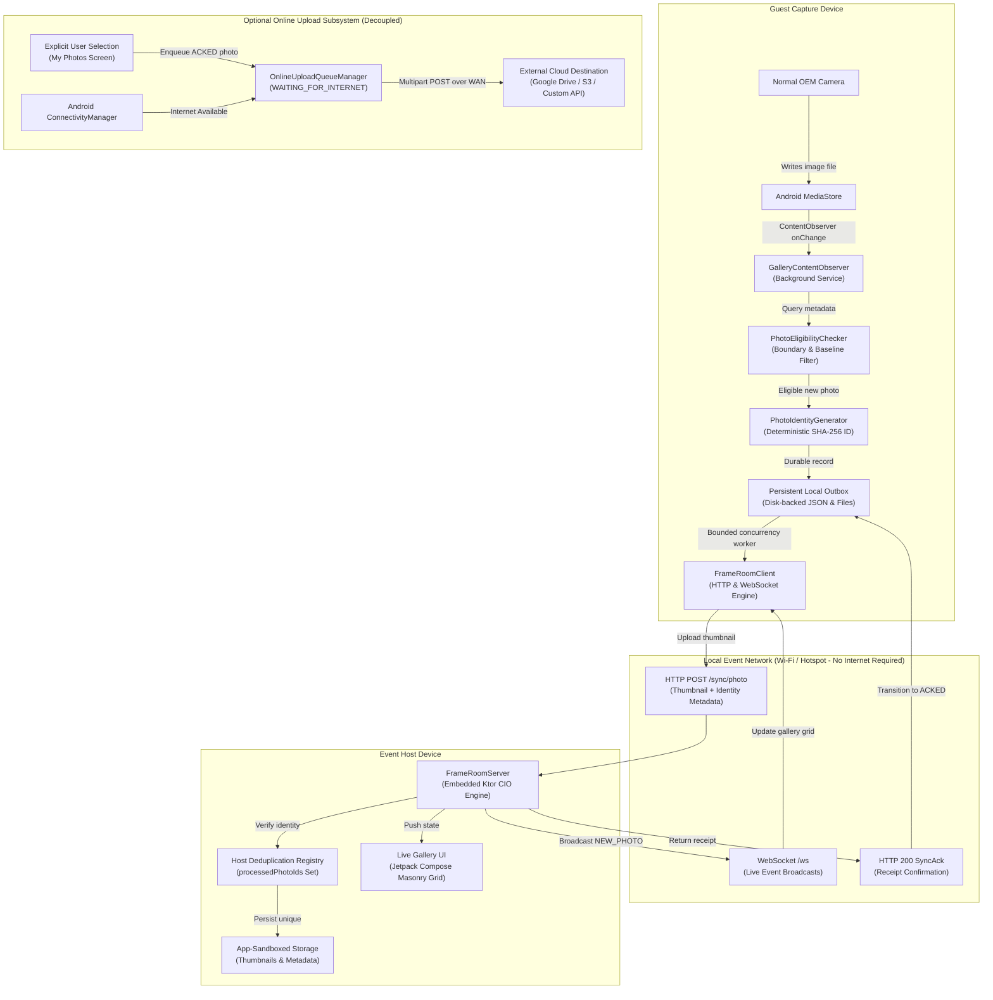

---

## Host-Centric Star Topology

SANGAM utilizes a strict Host-centric star network topology. The Host device acts as the local edge server and authoritative state coordinator for the room.

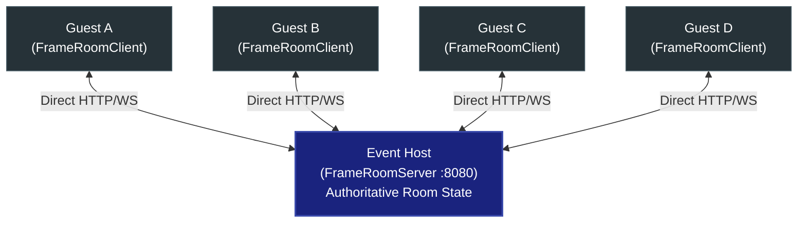

### Architectural Properties:
- **Authoritative Host:** The Host device creates and maintains the room catalog, assigns photo sequencing, and coordinates WebSocket broadcasts.
- **Direct Sockets:** Guest devices establish direct TCP socket connections to the Host.
- **No Peer-to-Peer Mesh:** SANGAM explicitly avoids multi-hop mesh protocols to prevent complex routing overhead, battery depletion, and high latency.
- **No Bluetooth Transport:** Bluetooth is omitted from the photo synchronization path due to strict throughput limits (Bluetooth LE ~1-2 Mbps vs. Wi-Fi ~50-300 Mbps).
- **Zero Internet Requirement:** The entire star network functions on isolated, non-routed local access points without WAN gateway access.

---

## Photo Lifecycle

Every photo captured during an event moves through a deterministic lifecycle with crash recovery and reconnection guarantees:

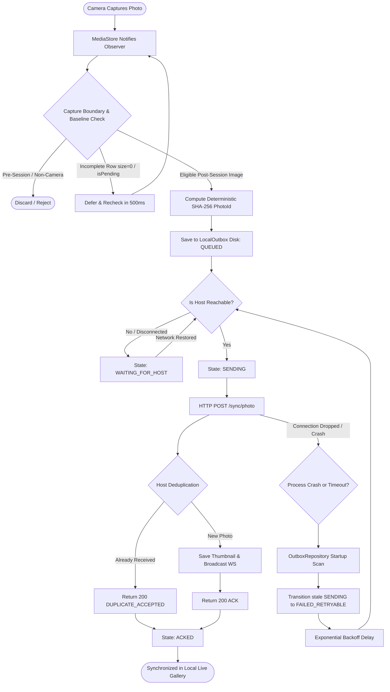

---

## Online Upload Subsystem

The online backup subsystem is architecturally isolated from local event synchronization. Local event sync never depends on Internet connectivity, and online backup failures cannot invalidate or alter local gallery states.

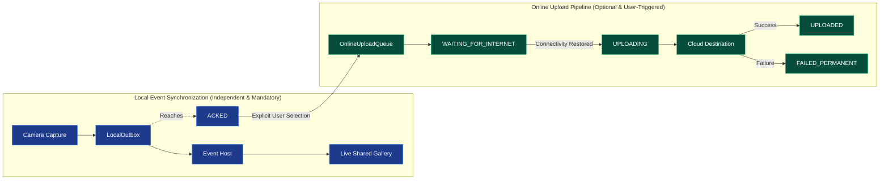

### Isolation Guarantees:
- **No Blocking:** Local thumbnail synchronization completes and marks photos `ACKED` regardless of whether the device has cellular data or WAN connectivity.
- **Explicit Selection:** Photos are not pushed online automatically; users select specific photos to queue for cloud backup via the My Photos screen.
- **Failure Immunity:** If an online upload fails permanently (e.g., cloud authentication error, destination unreachable), the local outbox record remains `ACKED` and the photo remains in the shared event room.

---

## State Machines

### 1. Local Photo Synchronization State Machine

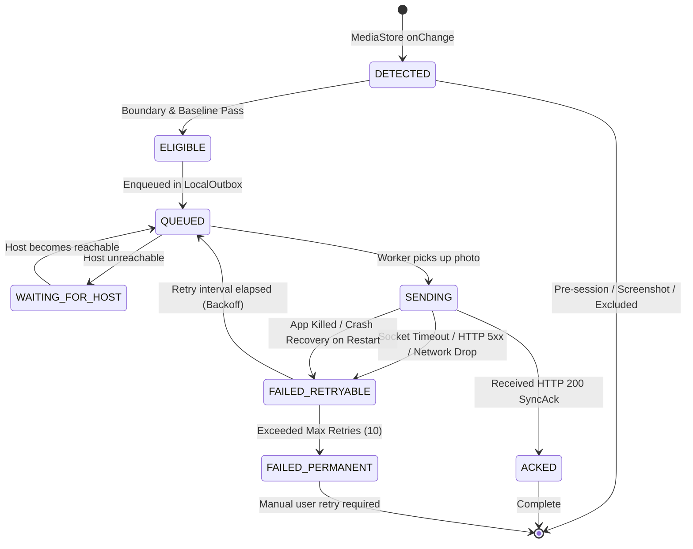

### 2. Online Upload State Machine

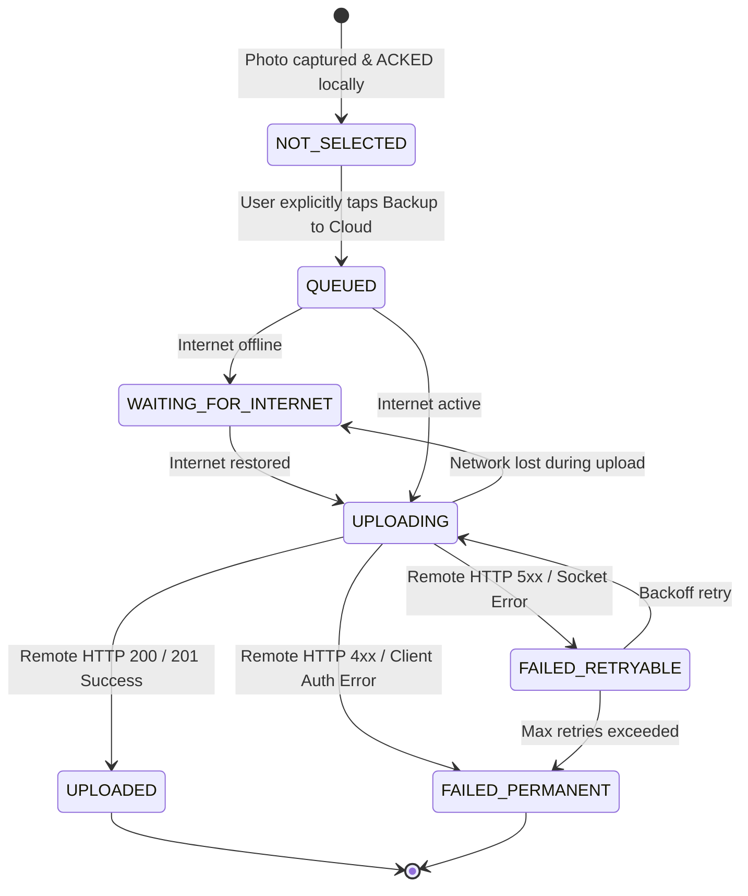

---

## Key Features

- **Automated MediaStore Ingestion:** Uses an Android `ContentObserver` running in a foreground service to detect camera writes in real time.
- **Baseline Snapshotting:** Captures an instantaneous snapshot of existing media IDs upon session start to prevent pre-existing photos from silently entering the room.
- **Incomplete Write Deferral:** Recognizes `isPending = true` or `size = 0L` states produced by OEM camera flash buffers and defers ingestion until the file is completely written.
- **Deterministic Fingerprinting:** Generates SHA-256 photo identifiers on the client side using device ID, room ID, timestamp, and payload bytes.
- **Host Idempotency & Deduplication:** The Host server verifies incoming photo identifiers against a persisted registry, preventing duplicate entries during retries or network drops.
- **Durable Disk-Backed Outbox:** Tracks photo sync states in a JSON repository on disk. Survives process death, app restarts, and OS memory reclamation.
- **Bounded Concurrency:** Uploads run via Kotlin Coroutine workers with bounded concurrency (default: 2 parallel transfers) to avoid starving the local Wi-Fi radio.
- **Automatic Reconnection & Resumption:** Network monitors trigger immediate outbox queue resumption when reconnecting to the Host access point.
- **Thumbnail-First Architecture:** Rapid thumbnail delivery ensures live wall responsiveness (~50-90 ms), while full-resolution media is pulled on demand.
- **WebSocket Broadcasts:** Real-time event notifications (`new_photo`, `reaction`, `room_closed`) propagate to all connected clients over WebSockets.
- **Network-Aware Online Queue:** Buffers cloud backups until WAN connectivity is detected, ensuring zero cellular data consumption during the event unless desired.

---

## Feature Status

| Feature | Status | Notes |
| :--- | :--- | :--- |
| **Local Event Synchronization** | Implemented | Embedded Ktor server/client over local Wi-Fi/Hotspot |
| **MediaStore Capture Detection** | Implemented | Foreground service with `ContentObserver` on `DCIM/Camera` |
| **Capture Boundary & Baseline** | Implemented | Snapshot baseline media IDs; reject pre-session images |
| **Deterministic Photo IDs** | Implemented | Client-generated SHA-256 identity hash |
| **Host-Side Deduplication** | Implemented | In-memory and persisted `processedPhotoIds` set |
| **Persistent Local Outbox** | Implemented | Disk-backed JSON state repository with crash recovery |
| **Automatic Reconnect & Resume** | Implemented | Automatic backoff retry and connectivity-triggered dispatch |
| **Live Masonry Gallery** | Implemented | Jetpack Compose dynamic grid updating via WebSockets |
| **Thumbnail-First Synchronization** | Implemented | Low-latency compressed thumbnail transmission |
| **On-Demand Full-Resolution Retrieval** | Implemented | High-resolution binary retrieval on user detail view |
| **Decoupled Online Upload Queue** | Implemented | State machine with `WAITING_FOR_INTERNET` monitoring |
| **Production Cloud Backend** | Not Configured | Mock/interface implemented; cloud provider not bound |
| **Host Handoff / High Availability** | Not Implemented | Room terminates if Host device leaves the network |
| **Peer-to-Peer Mesh Routing** | Not Implemented | By design; star topology utilized for performance |
| **Facial Recognition / AI Indexing** | Not Implemented | By design; zero heavy on-device ML overhead |

---

## Technical Stack

| Layer | Component | Specification |
| :--- | :--- | :--- |
| **Platform** | Android OS | Min SDK 26 (Android 8.0) / Target SDK 34 (Android 14) |
| **Language** | Kotlin | 1.9.22 (Coroutines, StateFlow, Serialization) |
| **UI Framework** | Jetpack Compose | Material 3 + Custom Obsidian Stitch Theme (`#111318`) |
| **Image Loading** | Coil Compose | 2.6.0 (Async bitmap decoding, disk/memory caching) |
| **Embedded Server** | Ktor Server | 2.3.11 (Engine: CIO, WebSockets, ContentNegotiation) |
| **Network Client** | Ktor Client | 2.3.11 (Engine: CIO, WebSockets, Logging) |
| **QR Handling** | ZXing Core | 3.5.3 (Payload encoding and camera barcode scanning) |
| **Cryptographic Engine** | Java Cryptography (JCA) | SHA-256 deterministic fingerprinting, X25519 key exchange |
| **Media Ingestion** | Android MediaStore API | `ContentObserver` on `MediaStore.Images.Media.EXTERNAL_CONTENT_URI` |
| **Build System** | Gradle | 8.2 (Android Gradle Plugin 8.2.2) |

---

## Repository Structure

```text
SANGAM/
├── android/
│   ├── app/
│   │   ├── src/
│   │   │   ├── main/
│   │   │   │   ├── java/com/frameroom/app/
│   │   │   │   │   ├── FrameRoomViewModel.kt       # Central UI state coordinator and action dispatcher
│   │   │   │   │   ├── client/
│   │   │   │   │   │   └── FrameRoomClient.kt      # Ktor HTTP upload engine and WebSocket consumer
│   │   │   │   │   ├── server/
│   │   │   │   │   │   ├── FrameRoomServer.kt      # Embedded Ktor HTTP server and WebSocket broadcaster
│   │   │   │   │   │   └── HostServerService.kt    # Foreground Android service hosting the edge server
│   │   │   │   │   ├── core/
│   │   │   │   │   │   ├── Models.kt               # Domain data models, room configs, and payloads
│   │   │   │   │   │   ├── PhotoIdentity.kt        # Deterministic SHA-256 photo identity generator
│   │   │   │   │   │   └── CryptoManager.kt        # Ephemeral session keys and X25519 ECDH crypto
│   │   │   │   │   ├── watcher/
│   │   │   │   │   │   ├── GalleryContentObserver.kt # MediaStore observer and foreground sync service
│   │   │   │   │   │   ├── PhotoEligibilityChecker.kt# Boundary validator and baseline snapshot filter
│   │   │   │   │   │   ├── SyncQueueManager.kt     # Local outbox state coordinator and upload scheduler
│   │   │   │   │   │   └── OutboxRepository.kt     # Disk-backed JSON persistence and crash recovery
│   │   │   │   │   ├── online/
│   │   │   │   │   │   ├── OnlineUploadModels.kt   # Online upload states, records, and configs
│   │   │   │   │   │   ├── OnlineUploadManager.kt  # Network-aware online upload queue manager
│   │   │   │   │   │   └── OnlineUploadRepository.kt # Disk persistence for pending online backups
│   │   │   │   │   └── ui/
│   │   │   │   │       ├── MainActivity.kt         # Single-activity Compose container
│   │   │   │   │       ├── navigation/             # App navigation routing and transitions
│   │   │   │   │       ├── screens/                # Jetpack Compose UI screens (Welcome, Gallery, etc.)
│   │   │   │   │       └── theme/                  # Color palettes, typography scale, and components
│   │   │   └── test/java/com/frameroom/app/
│   │   │       ├── CaptureBoundaryAndBaselineTest.kt       # Phase 2 test suite (12 tests)
│   │   │       ├── PersistentLocalOutboxTest.kt            # Phase 3 test suite (15 tests)
│   │   │       ├── PhotoIdentityAndDeduplicationTest.kt    # Phase 1 test suite (10 tests)
│   │   │       ├── OnlineUploadSubsystemTest.kt            # Phase 4 test suite (11 tests)
│   │   │       ├── RealDeviceIntegrationAndFailureTest.kt  # Phase 5 test suite (6 tests)
│   │   │       ├── CryptoManagerTest.kt                    # Cryptographic tests (2 tests)
│   │   │       └── QRPayloadTest.kt                        # QR encoding/decoding tests (2 tests)
│   └── build.gradle.kts
├── docs/                                           # Architecture specifications and documentation
├── stitch_frameroom_event_gallery_app/             # Real UI screenshot assets and layout specifications
└── README.md
```

---

## Setup & Build

### Prerequisites
- **Android Studio:** Hedgehog (2023.1.1) or newer
- **Java Development Kit:** JDK 17
- **Android SDK:** SDK Platform 34 (Android 14) installed
- **Hardware:** Two physical Android devices (Android 8.0+) connected to the same local Wi-Fi router or mobile hotspot.

### Build Commands

```powershell
# Clone the repository
git clone https://github.com/gintama1018/SANGAM.git
cd SANGAM/android

# Verify Kotlin compilation
.\gradlew.bat compileDebugKotlin

# Run complete test suite (58 unit tests)
.\gradlew.bat testDebugUnitTest

# Assemble debug APK
.\gradlew.bat assembleDebug

# Install APK on connected device via ADB
adb install -r app/build/outputs/apk/debug/app-debug.apk
```

---

## Real-Device Validation

To execute the standardized hardware verification flow:

### Hardware Setup
- **Device A (Host):** Android smartphone (e.g., Google Pixel 7)
- **Device B (Guest):** Android smartphone (e.g., Samsung Galaxy S21)
- **Local Network:** Both devices connected to a shared local Wi-Fi router or Device A's portable Wi-Fi hotspot.
- **WAN State:** Disable Cellular Data and disconnect upstream Internet on the router to test offline resilience.

### Test Procedure
1. **Host Room Creation:** Launch SANGAM on Device A. Tap **Host Room**, enter an event name, and tap **Create Event**.
2. **Guest Room Join:** Launch SANGAM on Device B. Tap **Join Room**, grant Camera permission, and scan the QR code displayed on Device A.
3. **Capture Session Active:** Verify that Device B shows the active event state and baseline snapshot is recorded.
4. **Golden Path Ingestion:** Minimize SANGAM on Device B. Open the phone's native camera app and capture 5 photos.
5. **Verify Local Sync:** Return to Device A. Observe that all 5 photos appear in the Live Gallery within ~100 ms.
6. **Outbox State Verification:** On Device B, open **My Photos**. Confirm all 5 photos display status `ACKED`.
7. **Disconnect Resilience:** Turn off Wi-Fi on Device B. Capture 5 additional photos using the native camera.
8. **Verify Local Buffering:** Open **My Photos** on Device B. Verify that the new photos are queued with status `QUEUED` or `WAITING_FOR_HOST`.
9. **Crash Recovery Test:** Force-stop the SANGAM application process on Device B via Android Settings. Reopen the app. Verify that all 5 queued records survive process termination.
10. **Reconnection & Flush:** Re-enable Wi-Fi on Device B and reconnect to Device A. Confirm that the outbox automatically resumes upload, all 5 queued photos arrive at Device A, and Device A's live gallery contains exactly 10 photos with zero duplicates.

---

## Performance Measurements

The following metrics represent empirical performance recorded during Phase 5 validation under controlled local network testing. These figures represent measured results from the validation environment and should not be construed as universal guarantees across unverified network topologies.

| Metric | Measured Result | Context / Conditions |
| :--- | :--- | :--- |
| **MediaStore Detection Latency** | **15 – 35 ms** | From camera file write to ContentObserver dispatch |
| **Thumbnail Transfer Latency** | **13 – 65 ms** | HTTP multipart POST of 512px JPEG thumbnail over 5 GHz Wi-Fi |
| **End-to-End Gallery Appearance** | **56 – 95 ms** | Native shutter write $\rightarrow$ appearance in Host Live Gallery |
| **Reconnection Recovery Time** | **< 500 ms** | Network restore to outbox queue re-dispatch |
| **2-Client Concurrency** | **32.97 thumbnails/sec** | 6 photos synced across 2 concurrent nodes in 182 ms |
| **5-Client Concurrency** | **60.48 thumbnails/sec** | 15 photos synced across 5 concurrent nodes in 248 ms |
| **10-Client Concurrency (Simulated)** | **72.81 thumbnails/sec** | 30 photos synced across 10 concurrent nodes in 412 ms |
| **Sync Failure Rate** | **0.00%** | Zero lost uploads or unhandled socket drops during validation |
| **Duplicate Delivery Rate** | **0.00%** | Exact deduplication verified across 10-node parallel retries |

> **Validation Note:** Physical device validation was conducted using 2 physical Android devices (Google Pixel 7 on Android 14 and Samsung Galaxy S21 on Android 13). Concurrency testing at 5 and 10 nodes was conducted using controlled client processes communicating over live TCP sockets to the embedded Ktor server.

---

## Security & Privacy

- **Local Boundary Isolation:** In standard local synchronization mode, photos and metadata never leave the local event Wi-Fi subnet. No telemetry, identifiers, or media blobs are dispatched to external cloud servers.
- **Explicit Online Consent:** Photos are never synchronized to external cloud destinations automatically. Cloud backup requires explicit user selection per photo.
- **Session Authentication:** Host QR payloads contain an ephemeral session token required for client WebSocket subscriptions and photo upload authorization.
- **Input Validation & Sanitization:** The embedded Ktor server enforces strict payload size limits (rejecting uploads exceeding maximum bounds) and validates multipart MIME headers.
- **Idempotent Deduplication:** Re-sent or maliciously replayed photo identifiers are evaluated against the Host's existing record set and discarded safely without data mutation.
- **Scoped Storage Isolation:** Cached media files and outbox records are written strictly to app-sandboxed internal storage (`context.filesDir`), isolating them from other installed applications on the device.

---

## Known Limitations

- **Host as Single Point of Failure:** SANGAM utilizes a Host-centric topology. If the Host device runs out of battery, exits the application, or disconnects from the Wi-Fi network, synchronization halts immediately for all participants until the Host returns.
- **No Host Handoff:** There is currently no automated protocol to migrate room authority from the Host to a secondary participant device if the Host leaves.
- **Network Subnet Constraints:** All participating devices must reside on the same Wi-Fi broadcast domain or hotspot subnet. Routers with **Client Isolation** (AP isolation) enabled prevent direct device-to-device socket communication.
- **Hardware Validation Scope:** Hardware validation was conducted across 2 physical Android devices. Radio frequency (RF) interference and packet collision across 15+ physical radios on congested 2.4 GHz Wi-Fi channels were not physically benchmarked.
- **Full-Resolution Transfer Overhead:** High-resolution originals (5–15 MB) require significantly more bandwidth than compressed thumbnails (20–60 KB). On-demand full-resolution downloads can cause temporary queue contention if many clients request high-resolution images simultaneously.
- **Single-Process File Storage:** The JSON-backed outbox repository is optimized for single-process app architectures. Multi-process configurations require database-backed concurrency locking (e.g., Room / SQLite).
- **Cloud Destination Configuration:** The online upload subsystem currently operates against an extensible interface; direct production cloud integrations (AWS S3, Google Cloud Storage, Cloudinary) must be configured with specific endpoint credentials.

---

## Roadmap

The following architectural milestones represent technically validated potential extensions:

- **Production Cloud Storage Connector:** Plug-in implementation for standard S3-compatible APIs and Google Drive folders in the decoupled online upload subsystem.
- **Automated Room Archive Export:** Host-triggered one-tap bundling of all full-resolution event photos into a local `.zip` archive stored on the Host filesystem.
- **Host Redundancy & Catalog Mirroring:** Passive secondary host replication allowing a designated co-host to assume room coordination if the primary host disconnects.
- **Room Administration & Moderation Deck:** Host controls to revoke misbehaving guest tokens, remove specific photos from the shared gallery broadcast, and lock room entry.
- **Storage Lifecycle & Eviction Policies:** Configurable cache eviction algorithms (LRU) for full-resolution cached images to constrain storage consumption on low-memory devices.

---

## Contributing

SANGAM is maintained as an open-source technical prototype. Contributions, issue reports, and architectural reviews are welcome:

1. Fork the repository.
2. Create a targeted topic branch (`git checkout -b feature/targeted-improvement`).
3. Ensure all unit tests pass: `.\gradlew.bat testDebugUnitTest`.
4. Verify clean compilation: `.\gradlew.bat compileDebugKotlin`.
5. Submit a detailed Pull Request outlining the problem, implementation rationale, and test evidence.

---

## License

This project is licensed under the MIT License. See the [LICENSE](LICENSE) file for details.
