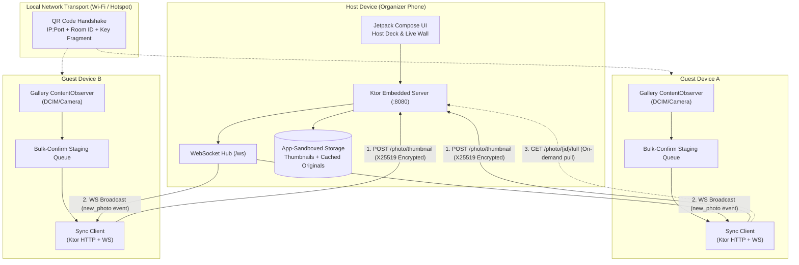

<!-- Banner / Logo Placeholder -->
<p align="center">
  
</p>

<h1 align="center">FrameRoom (Sangam)</h1>

<p align="center">
  <strong>Local-network real-time event photo synchronization and live gallery for Android.</strong>
</p>

<p align="center">
  
  
  
  
  
</p>

---

## Table of Contents

- [Demo](#demo)
- [Problem](#problem)
- [How It Works](#how-it-works)
- [Honest Positioning](#honest-positioning)
- [Architecture](#architecture)
- [Tech Stack](#tech-stack)
- [Quick Start](#quick-start)
- [Known Limitations](#known-limitations)
- [Security & Privacy](#security--privacy)
- [Roadmap](#roadmap)
- [Contributing](#contributing)
- [Credits](#credits)
- [License](#license)

---

## Demo

> **TODO:** Add demonstration video / GIF showing multi-device real-time photo capture, background gallery detection, bulk-confirmation, and instant live wall rendering over local Wi-Fi.

<!-- Demo asset placeholder: docs/assets/demo_live_sync.gif -->

---

## Problem

Group and event photo sharing today relies on two broken paths. In-the-moment sharing over WhatsApp forces attendees into repetitive $N \times N$ manual select-and-send actions where attendees constantly ask each other to send shots and someone always forgets. Post-event sharing via Google Drive results in unsorted photos dumped days or weeks later into flat folders that browse like document stores, making finding one's own photos among hundreds near-impossible.

---

## How It Works

- **Gallery Auto-Sync:** An Android MediaStore `ContentObserver` monitors the device's `DCIM/Camera` directory for new images captured during the active room window, eliminating manual in-app file selection.
- **Offline / Local-Only Transport:** All synchronization runs over local Wi-Fi or a mobile hotspot via embedded HTTP and WebSockets; zero external internet connection or cloud service is required.
- **Bulk-Confirm Staging:** Detected photos enter a local confirmation queue requiring an explicit user tap before any payload leaves the device, preventing accidental or private photos from syncing silently.
- **Thumbnail-First Live Wall:** Clients generate and push compressed thumbnails immediately for low-latency grid updates; full-resolution originals remain on the uploader's device and transfer only on explicit pull request.
- **Attribution and Reactions:** Every synchronized photo maintains uploader attribution, and participants can toggle live reactions that broadcast across connected peers in real time.

---

## Honest Positioning

Existing products such as GuestPix, Fotify, EventPics, and GuestSnap have established the QR-code event gallery category. However, these services require participants to manually upload photos through a web browser, rely on active internet connectivity to their proprietary cloud backends, and charge subscription fees ($30–$50 per event).

FrameRoom's differentiation lies in its technical mechanism, not in inventing the event-gallery concept:
1. **Automatic background gallery detection** instead of manual browser-based file picking.
2. **Strictly local, offline-first operation** over standard Wi-Fi or hotspot with zero infrastructure costs (zero cloud bill).
3. **Targeted at campus and community events** operating on zero budget rather than commercial wedding SaaS workflows.

---

## Architecture



FrameRoom uses a single Android codebase supporting two runtime roles: **Host** and **Client**. The host device acts as the local edge server for the duration of the event by running an embedded Ktor HTTP engine (CIO) and WebSocket broadcaster. Guest devices join the room by scanning an on-screen QR code containing the host's local IP address, port, room UUID, and an ephemeral public key fragment used to derive an X25519 session key. Once connected, guest clients monitor local storage changes, stage new photos for user confirmation, compress thumbnails client-side, and push encrypted binary blobs directly to the host's local endpoints.

---

## Tech Stack

| Layer | Technology | Purpose |
|---|---|---|
| **Language** | Kotlin 1.9+ | Primary application language |
| **UI Framework** | Jetpack Compose | Declarative UI, reactive state binding |
| **Design System** | Material 3 + Stitch Theme | Dark obsidian palette (`#111318`), custom typography scale |
| **Launch Animation** | `androidx.core:core-splashscreen` | Native AnimatedVectorDrawable shutter-click animation |
| **Embedded Server** | Ktor Server 2.3+ (CIO engine) | Local HTTP routing and WebSocket broadcasting on host |
| **Network Client** | Ktor Client 2.3+ (CIO engine) | HTTP photo upload and WebSocket event subscription on guests |
| **Image Loading** | Coil Compose 2.6+ | Asynchronous image decoding and caching |
| **QR Generation / Scanning** | ZXing Core + JourneyApps Embedded | QR payload encoding and camera-based join flow |
| **Concurrency** | Kotlin Coroutines + StateFlow | Reactive background processing and event streaming |
| **Security / Crypto** | Java Cryptography Architecture (JCA) | X25519 ECDH key derivation, AES-GCM app-layer encryption |
| **Local Media** | Android MediaStore API + `ContentObserver` | Camera roll delta detection within active event window |

---

## Quick Start

### Prerequisites
- Android Studio Iguana (2023.2.1) or newer
- JDK 17
- Android SDK Platform 34
- Minimum physical device or emulator: Android 8.0 (API level 26)

### Build Commands

```bash
# Clone the repository
git clone https://github.com/gintama1018/SANGAM.git
cd SANGAM/android

# Verify Kotlin compilation
./gradlew compileDebugKotlin

# Assemble debug APK
./gradlew assembleDebug

# Install on connected device via ADB
adb install -r app/build/outputs/apk/debug/app-debug.apk
```

### Required App Permissions
- `android.permission.INTERNET`: Required to bind the embedded Ktor socket and establish local socket connections.
- `android.permission.ACCESS_WIFI_STATE`, `android.permission.ACCESS_NETWORK_STATE`: Resolves local IP addresses and subnet interfaces.
- `android.permission.CAMERA`: Required for QR code viewfinder scanning on guest devices.
- `android.permission.READ_MEDIA_IMAGES` (API 33+) / `android.permission.READ_EXTERNAL_STORAGE` (API $\le$ 32): Required for the MediaStore `ContentObserver` to inspect new photos in `DCIM/Camera`.
- `android.permission.FOREGROUND_SERVICE`, `android.permission.FOREGROUND_SERVICE_DATA_SYNC`: Keeps the embedded host server and background sync active when the app is backgrounded.

---

## Known Limitations

- **Single Host as Single Point of Failure:** The entire room lifecycle and routing depends on the host device. If the host device powers down, closes the app, or disconnects from the Wi-Fi network, synchronization halts immediately for all participants.
- **No Data Survives Host Device Loss:** Because there is no remote cloud database, indexed room metadata and cached full-resolution photos reside exclusively in the host device's application-sandboxed storage. Loss or hardware failure of the host device results in permanent loss of unexported event data.
- **No AI Content Moderation:** The system does not run automated server-side or on-device computer vision models to flag inappropriate content. Moderation relies strictly on manual host removal and client-side private toggles.
- **Strictly Local Network Boundaries:** Devices must be connected to the exact same Wi-Fi subnet or host Wi-Fi hotspot. The system cannot traverse NAT boundaries, corporate firewalls that isolate client devices, or route across cellular WAN networks.

---

## Security & Privacy

FrameRoom enforces application-layer payload encryption using session keys derived via X25519 ECDH handshakes, ensuring payloads remain protected even when operating over open, unencrypted venue Wi-Fi networks. Photos are never uploaded silently by default; clients must review and trigger a bulk-confirm action, and users can mark individual photos private to exclude them from synchronization. All files are written strictly to app-sandboxed internal storage rather than public shared directories.

For full details regarding threat vectors, trust boundaries, and mitigation strategies, refer to the complete [Security Specification](files%20(8)/security.md).

---

## Roadmap

- [x] **Phase 0 — Foundation:** Project scaffolding, Jetpack Compose setup, Ktor server/client baseline, core permission management.
- [x] **Phase 1 — Core Room Lifecycle:** Host room creation, ephemeral QR code generation, local LAN discovery handshake, manual photo fallback.
- [x] **Phase 2 — MediaStore Detection:** Background `ContentObserver` for `DCIM/Camera`, active event window timestamp filtering, client-side bulk-confirmation staging UI.
- [x] **Phase 3 — Social Layer & UI Overhaul:** Stitch design system overhaul, masonry live gallery, contributor attribution chips, live reactions dock, native shutter AnimatedVectorDrawable splash screen.
- [ ] **Phase 4 — Archive & Export:** End-of-event room freezing, ZIP archive export from host storage, top-reacted highlight slideshow reel.
- [ ] **Install-Free Web Spectator:** Lightweight read-only browser client served directly from the host's embedded Ktor HTTP server for non-Android participants.
- [ ] **Multi-Host Redundancy:** Secondary host election and distributed catalog replication to mitigate single-device host failure.

---

## Contributing

FrameRoom is currently a hackathon-stage prototype maintained by the core team and is not actively accepting external pull requests. Feedback, bug reports, and architectural discussions are welcome via [GitHub Issues](https://github.com/gintama1018/SANGAM/issues).

---

## Credits

Developed by **Team Gintama**:
- **GitHub:** [@gintama1018](https://github.com/gintama1018)
- **Email:** `Sonu.jangir2024@uem.edu.in`

---

## License

This project is licensed under the terms of the [MIT License](LICENSE).
